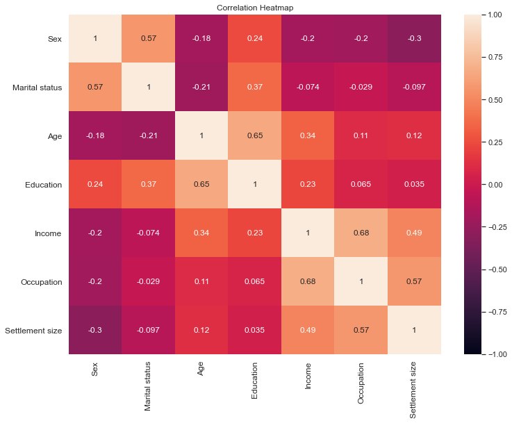
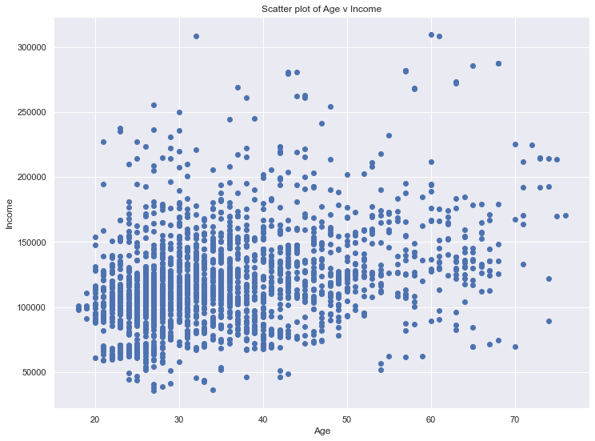
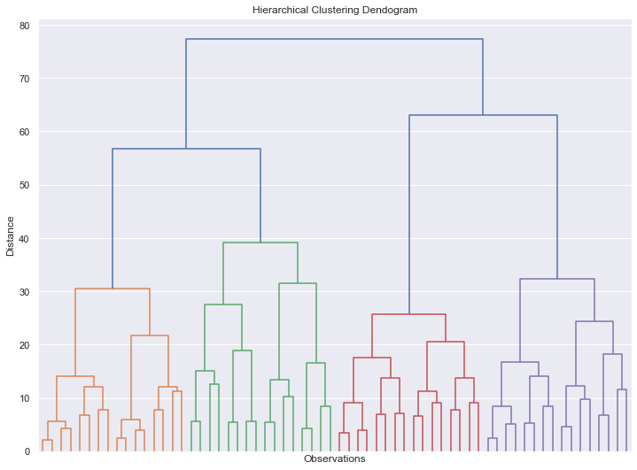
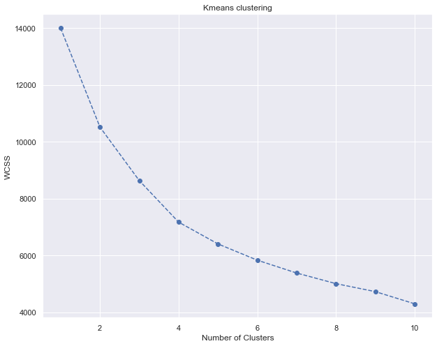
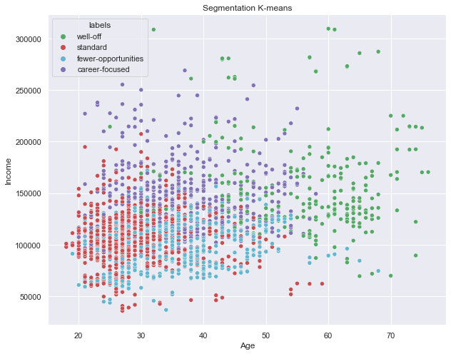
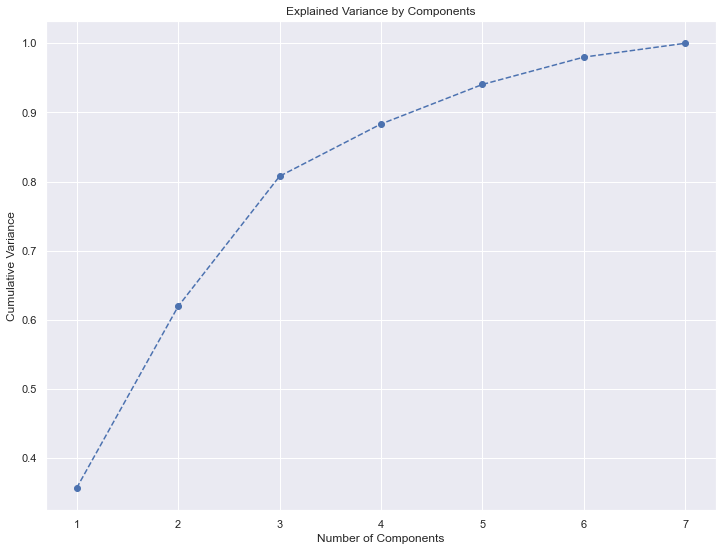
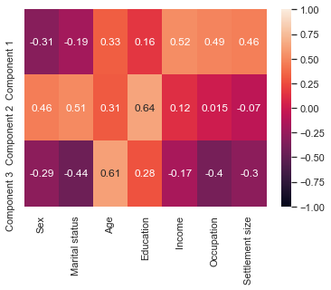
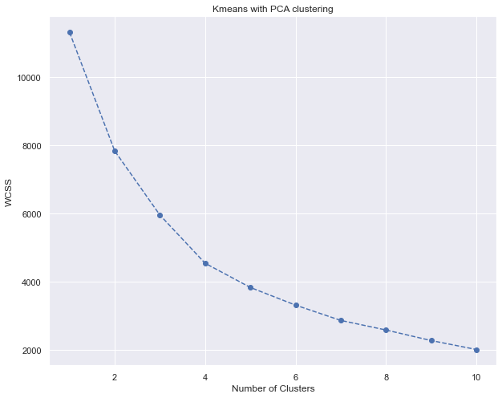
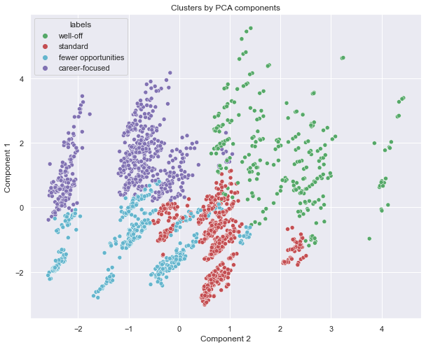

# CustomerAnalytics_CustomerSegmentation
Part 1 for customer analytics, where I segment the customers using clustering techniques (Hierarchical and KMeans) and using Dimensionality Reduction technique PCA with KMeans 

# Customer Analytics (Part 1) - Segmentation

#### Importing libraries and data


```python
import pandas as pd, numpy as np, matplotlib.pyplot as plt, seaborn as sns
import scipy
sns.set()
```


```python

```


```python
df = pd.read_csv('/Users/mhlaghari/Downloads/segmentation data.csv', index_col=0)
```


```python
df
```


<div>

<table border="1" class="dataframe">
  <thead>
    <tr style="text-align: right;">
      <th></th>
      <th>Sex</th>
      <th>Marital status</th>
      <th>Age</th>
      <th>Education</th>
      <th>Income</th>
      <th>Occupation</th>
      <th>Settlement size</th>
    </tr>
    <tr>
      <th>ID</th>
      <th></th>
      <th></th>
      <th></th>
      <th></th>
      <th></th>
      <th></th>
      <th></th>
    </tr>
  </thead>
  <tbody>
    <tr>
      <th>100000001</th>
      <td>0</td>
      <td>0</td>
      <td>67</td>
      <td>2</td>
      <td>124670</td>
      <td>1</td>
      <td>2</td>
    </tr>
    <tr>
      <th>100000002</th>
      <td>1</td>
      <td>1</td>
      <td>22</td>
      <td>1</td>
      <td>150773</td>
      <td>1</td>
      <td>2</td>
    </tr>
    <tr>
      <th>100000003</th>
      <td>0</td>
      <td>0</td>
      <td>49</td>
      <td>1</td>
      <td>89210</td>
      <td>0</td>
      <td>0</td>
    </tr>
    <tr>
      <th>100000004</th>
      <td>0</td>
      <td>0</td>
      <td>45</td>
      <td>1</td>
      <td>171565</td>
      <td>1</td>
      <td>1</td>
    </tr>
    <tr>
      <th>100000005</th>
      <td>0</td>
      <td>0</td>
      <td>53</td>
      <td>1</td>
      <td>149031</td>
      <td>1</td>
      <td>1</td>
    </tr>
    <tr>
      <th>...</th>
      <td>...</td>
      <td>...</td>
      <td>...</td>
      <td>...</td>
      <td>...</td>
      <td>...</td>
      <td>...</td>
    </tr>
    <tr>
      <th>100001996</th>
      <td>1</td>
      <td>0</td>
      <td>47</td>
      <td>1</td>
      <td>123525</td>
      <td>0</td>
      <td>0</td>
    </tr>
    <tr>
      <th>100001997</th>
      <td>1</td>
      <td>1</td>
      <td>27</td>
      <td>1</td>
      <td>117744</td>
      <td>1</td>
      <td>0</td>
    </tr>
    <tr>
      <th>100001998</th>
      <td>0</td>
      <td>0</td>
      <td>31</td>
      <td>0</td>
      <td>86400</td>
      <td>0</td>
      <td>0</td>
    </tr>
    <tr>
      <th>100001999</th>
      <td>1</td>
      <td>1</td>
      <td>24</td>
      <td>1</td>
      <td>97968</td>
      <td>0</td>
      <td>0</td>
    </tr>
    <tr>
      <th>100002000</th>
      <td>0</td>
      <td>0</td>
      <td>25</td>
      <td>0</td>
      <td>68416</td>
      <td>0</td>
      <td>0</td>
    </tr>
  </tbody>
</table>
<p>2000 rows × 7 columns</p>
</div>


```python
df.describe()
```


<div>

<table border="1" class="dataframe">
  <thead>
    <tr style="text-align: right;">
      <th></th>
      <th>Sex</th>
      <th>Marital status</th>
      <th>Age</th>
      <th>Education</th>
      <th>Income</th>
      <th>Occupation</th>
      <th>Settlement size</th>
    </tr>
  </thead>
  <tbody>
    <tr>
      <th>count</th>
      <td>2000.000000</td>
      <td>2000.000000</td>
      <td>2000.000000</td>
      <td>2000.00000</td>
      <td>2000.000000</td>
      <td>2000.000000</td>
      <td>2000.000000</td>
    </tr>
    <tr>
      <th>mean</th>
      <td>0.457000</td>
      <td>0.496500</td>
      <td>35.909000</td>
      <td>1.03800</td>
      <td>120954.419000</td>
      <td>0.810500</td>
      <td>0.739000</td>
    </tr>
    <tr>
      <th>std</th>
      <td>0.498272</td>
      <td>0.500113</td>
      <td>11.719402</td>
      <td>0.59978</td>
      <td>38108.824679</td>
      <td>0.638587</td>
      <td>0.812533</td>
    </tr>
    <tr>
      <th>min</th>
      <td>0.000000</td>
      <td>0.000000</td>
      <td>18.000000</td>
      <td>0.00000</td>
      <td>35832.000000</td>
      <td>0.000000</td>
      <td>0.000000</td>
    </tr>
    <tr>
      <th>25%</th>
      <td>0.000000</td>
      <td>0.000000</td>
      <td>27.000000</td>
      <td>1.00000</td>
      <td>97663.250000</td>
      <td>0.000000</td>
      <td>0.000000</td>
    </tr>
    <tr>
      <th>50%</th>
      <td>0.000000</td>
      <td>0.000000</td>
      <td>33.000000</td>
      <td>1.00000</td>
      <td>115548.500000</td>
      <td>1.000000</td>
      <td>1.000000</td>
    </tr>
    <tr>
      <th>75%</th>
      <td>1.000000</td>
      <td>1.000000</td>
      <td>42.000000</td>
      <td>1.00000</td>
      <td>138072.250000</td>
      <td>1.000000</td>
      <td>1.000000</td>
    </tr>
    <tr>
      <th>max</th>
      <td>1.000000</td>
      <td>1.000000</td>
      <td>76.000000</td>
      <td>3.00000</td>
      <td>309364.000000</td>
      <td>2.000000</td>
      <td>2.000000</td>
    </tr>
  </tbody>
</table>
</div>


#### Creating a heatmap to see correlations


```python
plt.figure(figsize = (12,9))
s = sns.heatmap(df.corr(), annot=True, vmax=1, vmin=-1)
s.set_yticklabels(s.get_yticklabels(),rotation=0, fontsize =12)
s.set_xticklabels(s.get_xticklabels(), rotation = 90, fontsize = 12)
plt.title ('Correlation Heatmap')

```


    Text(0.5, 1.0, 'Correlation Heatmap')


    

    


```python
plt.figure(figsize=(12,9))
plt.scatter(df.iloc[:,2],df.iloc[:,4])
plt.xlabel('Age')
plt.ylabel('Income')
plt.title('Scatter plot of Age v Income')
```


    Text(0.5, 1.0, 'Scatter plot of Age v Income')


    

    


#### Performing Clustering techniques


```python
from sklearn.preprocessing import StandardScaler
```


```python
scaler = StandardScaler()
segmentation_std = scaler.fit_transform(df)
```


```python
from scipy.cluster.hierarchy import dendrogram, linkage
```


```python
hier_clust = linkage(segmentation_std, method='ward')
```


```python
plt.figure(figsize=(12,9))
plt.title("Hierarchical Clustering Dendogram")
plt.xlabel('Observations')
plt.ylabel('Distance')
dendrogram(hier_clust,truncate_mode='level', p=5, show_leaf_counts= False, 
           no_labels= True
        )
plt.show()
```


    

    


#  KMeans Cluster


```python
from sklearn.cluster import KMeans
```


```python
wcss = []
for i in range(1,11):
    kmeans = KMeans(n_clusters = i, init = 'k-means++', random_state= 42)
    kmeans.fit(segmentation_std)
    wcss.append(kmeans.inertia_)
```


```python
plt.figure(figsize=(10,8))
plt.plot(range(1,11), wcss, marker ='o', linestyle = '--')
plt.xlabel("Number of Clusters")
plt.ylabel('WCSS')
plt.title('Kmeans clustering')
plt.show()
```


    

    


```python
kmeans = KMeans(n_clusters = 4, init='k-means++', random_state=42)
```


```python
kmeans.fit(segmentation_std)
```


    KMeans(n_clusters=4, random_state=42)


```python
df_segm_kmeans = df.copy()
df_segm_kmeans['Segment K-Means'] = kmeans.labels_
```


```python
df_segm_analysis = df_segm_kmeans.groupby(['Segment K-Means']).mean()
df_segm_analysis
```


<div>

<table border="1" class="dataframe">
  <thead>
    <tr style="text-align: right;">
      <th></th>
      <th>Sex</th>
      <th>Marital status</th>
      <th>Age</th>
      <th>Education</th>
      <th>Income</th>
      <th>Occupation</th>
      <th>Settlement size</th>
    </tr>
    <tr>
      <th>Segment K-Means</th>
      <th></th>
      <th></th>
      <th></th>
      <th></th>
      <th></th>
      <th></th>
      <th></th>
    </tr>
  </thead>
  <tbody>
    <tr>
      <th>0</th>
      <td>0.501901</td>
      <td>0.692015</td>
      <td>55.703422</td>
      <td>2.129278</td>
      <td>158338.422053</td>
      <td>1.129278</td>
      <td>1.110266</td>
    </tr>
    <tr>
      <th>1</th>
      <td>0.352814</td>
      <td>0.019481</td>
      <td>35.577922</td>
      <td>0.746753</td>
      <td>97859.852814</td>
      <td>0.329004</td>
      <td>0.043290</td>
    </tr>
    <tr>
      <th>2</th>
      <td>0.853901</td>
      <td>0.997163</td>
      <td>28.963121</td>
      <td>1.068085</td>
      <td>105759.119149</td>
      <td>0.634043</td>
      <td>0.422695</td>
    </tr>
    <tr>
      <th>3</th>
      <td>0.029825</td>
      <td>0.173684</td>
      <td>35.635088</td>
      <td>0.733333</td>
      <td>141218.249123</td>
      <td>1.271930</td>
      <td>1.522807</td>
    </tr>
  </tbody>
</table>
</div>


```python
df_segm_analysis['N Obs'] = df_segm_kmeans[['Segment K-Means','Sex']].groupby(['Segment K-Means']).count()
df_segm_analysis['Prop Obs'] = df_segm_analysis['N Obs']/df_segm_analysis['N Obs'].sum()
```


```python
df_segm_analysis
```


<div>

<table border="1" class="dataframe">
  <thead>
    <tr style="text-align: right;">
      <th></th>
      <th>Sex</th>
      <th>Marital status</th>
      <th>Age</th>
      <th>Education</th>
      <th>Income</th>
      <th>Occupation</th>
      <th>Settlement size</th>
      <th>N Obs</th>
      <th>Prop Obs</th>
    </tr>
    <tr>
      <th>Segment K-Means</th>
      <th></th>
      <th></th>
      <th></th>
      <th></th>
      <th></th>
      <th></th>
      <th></th>
      <th></th>
      <th></th>
    </tr>
  </thead>
  <tbody>
    <tr>
      <th>0</th>
      <td>0.501901</td>
      <td>0.692015</td>
      <td>55.703422</td>
      <td>2.129278</td>
      <td>158338.422053</td>
      <td>1.129278</td>
      <td>1.110266</td>
      <td>263</td>
      <td>0.1315</td>
    </tr>
    <tr>
      <th>1</th>
      <td>0.352814</td>
      <td>0.019481</td>
      <td>35.577922</td>
      <td>0.746753</td>
      <td>97859.852814</td>
      <td>0.329004</td>
      <td>0.043290</td>
      <td>462</td>
      <td>0.2310</td>
    </tr>
    <tr>
      <th>2</th>
      <td>0.853901</td>
      <td>0.997163</td>
      <td>28.963121</td>
      <td>1.068085</td>
      <td>105759.119149</td>
      <td>0.634043</td>
      <td>0.422695</td>
      <td>705</td>
      <td>0.3525</td>
    </tr>
    <tr>
      <th>3</th>
      <td>0.029825</td>
      <td>0.173684</td>
      <td>35.635088</td>
      <td>0.733333</td>
      <td>141218.249123</td>
      <td>1.271930</td>
      <td>1.522807</td>
      <td>570</td>
      <td>0.2850</td>
    </tr>
  </tbody>
</table>
</div>


```python
  df_segm_analysis.rename({0: 'well-off',
                          1: 'fewer-opportunities',
                          2: 'standard',
                          3: 'career-focused'})
```


<div>

<table border="1" class="dataframe">
  <thead>
    <tr style="text-align: right;">
      <th></th>
      <th>Sex</th>
      <th>Marital status</th>
      <th>Age</th>
      <th>Education</th>
      <th>Income</th>
      <th>Occupation</th>
      <th>Settlement size</th>
      <th>N Obs</th>
      <th>Prop Obs</th>
    </tr>
    <tr>
      <th>Segment K-Means</th>
      <th></th>
      <th></th>
      <th></th>
      <th></th>
      <th></th>
      <th></th>
      <th></th>
      <th></th>
      <th></th>
    </tr>
  </thead>
  <tbody>
    <tr>
      <th>well-off</th>
      <td>0.501901</td>
      <td>0.692015</td>
      <td>55.703422</td>
      <td>2.129278</td>
      <td>158338.422053</td>
      <td>1.129278</td>
      <td>1.110266</td>
      <td>263</td>
      <td>0.1315</td>
    </tr>
    <tr>
      <th>fewer-opportunities</th>
      <td>0.352814</td>
      <td>0.019481</td>
      <td>35.577922</td>
      <td>0.746753</td>
      <td>97859.852814</td>
      <td>0.329004</td>
      <td>0.043290</td>
      <td>462</td>
      <td>0.2310</td>
    </tr>
    <tr>
      <th>standard</th>
      <td>0.853901</td>
      <td>0.997163</td>
      <td>28.963121</td>
      <td>1.068085</td>
      <td>105759.119149</td>
      <td>0.634043</td>
      <td>0.422695</td>
      <td>705</td>
      <td>0.3525</td>
    </tr>
    <tr>
      <th>career-focused</th>
      <td>0.029825</td>
      <td>0.173684</td>
      <td>35.635088</td>
      <td>0.733333</td>
      <td>141218.249123</td>
      <td>1.271930</td>
      <td>1.522807</td>
      <td>570</td>
      <td>0.2850</td>
    </tr>
  </tbody>
</table>
</div>


```python
df_segm_kmeans['labels'] = df_segm_kmeans['Segment K-Means'].map({0: 'well-off',
                          1: 'fewer-opportunities',
                          2: 'standard',
                          3: 'career-focused'})
```


```python
x_axis = df_segm_kmeans['Age']
y_axis = df_segm_kmeans['Income']
plt.figure(figsize=(10,8))
sns.scatterplot(x_axis, y_axis, hue=df_segm_kmeans['labels'], palette=['g','r','c','m']
        )
plt.title('Segmentation K-means')
plt.show()
```

    /usr/local/Cellar/jupyterlab/2.2.9_1/libexec/lib/python3.9/site-packages/seaborn/_decorators.py:36: FutureWarning: Pass the following variables as keyword args: x, y. From version 0.12, the only valid positional argument will be `data`, and passing other arguments without an explicit keyword will result in an error or misinterpretation.
      warnings.warn(


    

    


#  KMeans Clutering with PCA


```python
from sklearn.decomposition import PCA
```


```python
pca = PCA()
```


```python
pca.fit(segmentation_std)
```


    PCA()


```python
pca.explained_variance_ratio_
```


    array([0.35696328, 0.26250923, 0.18821114, 0.0755775 , 0.05716512,
           0.03954794, 0.02002579])


```python
plt.figure(figsize= (12,9))
plt.plot(range(1,8), pca.explained_variance_ratio_.cumsum(), marker = 'o', linestyle = '--')
plt.title('Explained Variance by Components')
plt.xlabel('Number of Components')
plt.ylabel('Cumulative Variance')
```


    Text(0, 0.5, 'Cumulative Variance')


    

    


```python
pca = PCA(n_components= 3)
```


```python
pca.fit(segmentation_std)
```


    PCA(n_components=3)


```python
pca.components_
```


    array([[-0.31469524, -0.19170439,  0.32609979,  0.15684089,  0.52452463,
             0.49205868,  0.46478852],
           [ 0.45800608,  0.51263492,  0.31220793,  0.63980683,  0.12468314,
             0.01465779, -0.06963165],
           [-0.29301261, -0.44197739,  0.60954372,  0.27560461, -0.16566231,
            -0.39550539, -0.29568503]])


```python
df_pca_comp = pd.DataFrame(data = pca.components_, columns= df.columns.values,
                          index = ['Component 1', 'Component 2', 'Component 3'])
df_pca_comp
```


<div>

<table border="1" class="dataframe">
  <thead>
    <tr style="text-align: right;">
      <th></th>
      <th>Sex</th>
      <th>Marital status</th>
      <th>Age</th>
      <th>Education</th>
      <th>Income</th>
      <th>Occupation</th>
      <th>Settlement size</th>
    </tr>
  </thead>
  <tbody>
    <tr>
      <th>Component 1</th>
      <td>-0.314695</td>
      <td>-0.191704</td>
      <td>0.326100</td>
      <td>0.156841</td>
      <td>0.524525</td>
      <td>0.492059</td>
      <td>0.464789</td>
    </tr>
    <tr>
      <th>Component 2</th>
      <td>0.458006</td>
      <td>0.512635</td>
      <td>0.312208</td>
      <td>0.639807</td>
      <td>0.124683</td>
      <td>0.014658</td>
      <td>-0.069632</td>
    </tr>
    <tr>
      <th>Component 3</th>
      <td>-0.293013</td>
      <td>-0.441977</td>
      <td>0.609544</td>
      <td>0.275605</td>
      <td>-0.165662</td>
      <td>-0.395505</td>
      <td>-0.295685</td>
    </tr>
  </tbody>
</table>
</div>


```python
sns.heatmap(df_pca_comp, vmin=-1, vmax=1, annot=True)
```


    <AxesSubplot:>


    

    


```python
pca.transform(segmentation_std)
```


    array([[ 2.51474593,  0.83412239,  2.1748059 ],
           [ 0.34493528,  0.59814564, -2.21160279],
           [-0.65106267, -0.68009318,  2.2804186 ],
           ...,
           [-1.45229829, -2.23593665,  0.89657125],
           [-2.24145254,  0.62710847, -0.53045631],
           [-1.86688505, -2.45467234,  0.66262172]])


```python
scores_pca = pca.transform(segmentation_std)
```


```python
wcss = []
for i in range (1,11):
    kmeans = KMeans(n_clusters = i, init = 'k-means++', random_state= 42)
    kmeans.fit(scores_pca)
    wcss.append(kmeans.inertia_)

```


```python
plt.figure(figsize=(10,8))
plt.plot(range(1,11), wcss, marker ='o', linestyle = '--')
plt.xlabel("Number of Clusters")
plt.ylabel('WCSS')
plt.title('Kmeans with PCA clustering')
plt.show()
```


    

    


```python
kmeans_pca = KMeans(n_clusters = 4, init = 'k-means++', random_state= 42)
```


```python
kmeans_pca.fit(scores_pca)
```


    KMeans(n_clusters=4, random_state=42)


# Kmeans PCA Results


```python
df_segm_kmeans_pca = pd.concat([df.reset_index(drop=True), pd.DataFrame(scores_pca)], axis=1)
df_segm_kmeans_pca.columns.values[-3:] = ['Component 1','Component 2','Component 3']
df_segm_kmeans_pca['Segment K-Means PCA'] = kmeans_pca.labels_
```


```python
df_segm_kmeans_pca_frequency = df_segm_kmeans_pca.groupby(['Segment K-Means PCA']).mean()
df_segm_kmeans_pca_frequency
```


<div>

<table border="1" class="dataframe">
  <thead>
    <tr style="text-align: right;">
      <th></th>
      <th>Sex</th>
      <th>Marital status</th>
      <th>Age</th>
      <th>Education</th>
      <th>Income</th>
      <th>Occupation</th>
      <th>Settlement size</th>
      <th>Component 1</th>
      <th>Component 2</th>
      <th>Component 3</th>
    </tr>
    <tr>
      <th>Segment K-Means PCA</th>
      <th></th>
      <th></th>
      <th></th>
      <th></th>
      <th></th>
      <th></th>
      <th></th>
      <th></th>
      <th></th>
      <th></th>
    </tr>
  </thead>
  <tbody>
    <tr>
      <th>0</th>
      <td>0.900289</td>
      <td>0.965318</td>
      <td>28.878613</td>
      <td>1.060694</td>
      <td>107551.500000</td>
      <td>0.677746</td>
      <td>0.440751</td>
      <td>-1.107019</td>
      <td>0.703776</td>
      <td>-0.781410</td>
    </tr>
    <tr>
      <th>1</th>
      <td>0.027444</td>
      <td>0.168096</td>
      <td>35.737564</td>
      <td>0.734134</td>
      <td>141525.826758</td>
      <td>1.267581</td>
      <td>1.480274</td>
      <td>1.372663</td>
      <td>-1.046172</td>
      <td>-0.248046</td>
    </tr>
    <tr>
      <th>2</th>
      <td>0.306522</td>
      <td>0.095652</td>
      <td>35.313043</td>
      <td>0.760870</td>
      <td>93692.567391</td>
      <td>0.252174</td>
      <td>0.039130</td>
      <td>-1.046406</td>
      <td>-0.902963</td>
      <td>1.003644</td>
    </tr>
    <tr>
      <th>3</th>
      <td>0.505660</td>
      <td>0.690566</td>
      <td>55.679245</td>
      <td>2.128302</td>
      <td>158019.101887</td>
      <td>1.120755</td>
      <td>1.101887</td>
      <td>1.687328</td>
      <td>2.031200</td>
      <td>0.844039</td>
    </tr>
  </tbody>
</table>
</div>


```python
df_segm_kmeans_pca_frequency['N Obs'] = df_segm_kmeans_pca[['Segment K-Means PCA','Sex']].groupby(['Segment K-Means PCA']).count()
df_segm_kmeans_pca_frequency['Prop Obs'] = df_segm_kmeans_pca_frequency['N Obs']/df_segm_kmeans_pca_frequency['N Obs'].sum()
df_segm_kmeans_pca_frequency = df_segm_kmeans_pca_frequency.rename({0: 'standard',
                          1: 'career-focused',
                          2: 'fewer opportunities',
                          3: 'well-off'})
df_segm_kmeans_pca_frequency

```


<div>

<table border="1" class="dataframe">
  <thead>
    <tr style="text-align: right;">
      <th></th>
      <th>Sex</th>
      <th>Marital status</th>
      <th>Age</th>
      <th>Education</th>
      <th>Income</th>
      <th>Occupation</th>
      <th>Settlement size</th>
      <th>Component 1</th>
      <th>Component 2</th>
      <th>Component 3</th>
      <th>N Obs</th>
      <th>Prop Obs</th>
    </tr>
    <tr>
      <th>Segment K-Means PCA</th>
      <th></th>
      <th></th>
      <th></th>
      <th></th>
      <th></th>
      <th></th>
      <th></th>
      <th></th>
      <th></th>
      <th></th>
      <th></th>
      <th></th>
    </tr>
  </thead>
  <tbody>
    <tr>
      <th>standard</th>
      <td>0.900289</td>
      <td>0.965318</td>
      <td>28.878613</td>
      <td>1.060694</td>
      <td>107551.500000</td>
      <td>0.677746</td>
      <td>0.440751</td>
      <td>-1.107019</td>
      <td>0.703776</td>
      <td>-0.781410</td>
      <td>692</td>
      <td>0.3460</td>
    </tr>
    <tr>
      <th>career-focused</th>
      <td>0.027444</td>
      <td>0.168096</td>
      <td>35.737564</td>
      <td>0.734134</td>
      <td>141525.826758</td>
      <td>1.267581</td>
      <td>1.480274</td>
      <td>1.372663</td>
      <td>-1.046172</td>
      <td>-0.248046</td>
      <td>583</td>
      <td>0.2915</td>
    </tr>
    <tr>
      <th>fewer opportunities</th>
      <td>0.306522</td>
      <td>0.095652</td>
      <td>35.313043</td>
      <td>0.760870</td>
      <td>93692.567391</td>
      <td>0.252174</td>
      <td>0.039130</td>
      <td>-1.046406</td>
      <td>-0.902963</td>
      <td>1.003644</td>
      <td>460</td>
      <td>0.2300</td>
    </tr>
    <tr>
      <th>well-off</th>
      <td>0.505660</td>
      <td>0.690566</td>
      <td>55.679245</td>
      <td>2.128302</td>
      <td>158019.101887</td>
      <td>1.120755</td>
      <td>1.101887</td>
      <td>1.687328</td>
      <td>2.031200</td>
      <td>0.844039</td>
      <td>265</td>
      <td>0.1325</td>
    </tr>
  </tbody>
</table>
</div>


```python
df_segm_kmeans_pca['labels'] = df_segm_kmeans_pca['Segment K-Means PCA'].map({0: 'standard',
                          1: 'career-focused',
                          2: 'fewer opportunities',
                          3: 'well-off'})
```


```python
x_axis = df_segm_kmeans_pca['Component 2']
y_axis = df_segm_kmeans_pca['Component 1']
plt.figure(figsize=(10,8))
sns.scatterplot(x_axis, y_axis, hue=df_segm_kmeans_pca['labels'], palette= ['g','r','c','m'])
plt.title('Clusters by PCA components')
plt.show()
```

    /usr/local/Cellar/jupyterlab/2.2.9_1/libexec/lib/python3.9/site-packages/seaborn/_decorators.py:36: FutureWarning: Pass the following variables as keyword args: x, y. From version 0.12, the only valid positional argument will be `data`, and passing other arguments without an explicit keyword will result in an error or misinterpretation.
      warnings.warn(


    

    


#  Export


```python
import pickle
```


```python
pickle.dump(scaler, open('scaler.pickle','wb'))
pickle.dump(pca, open('pca.pickle','wb'))
pickle.dump(kmeans_pca, open('kmeans_pca.pickle','wb'))
```
